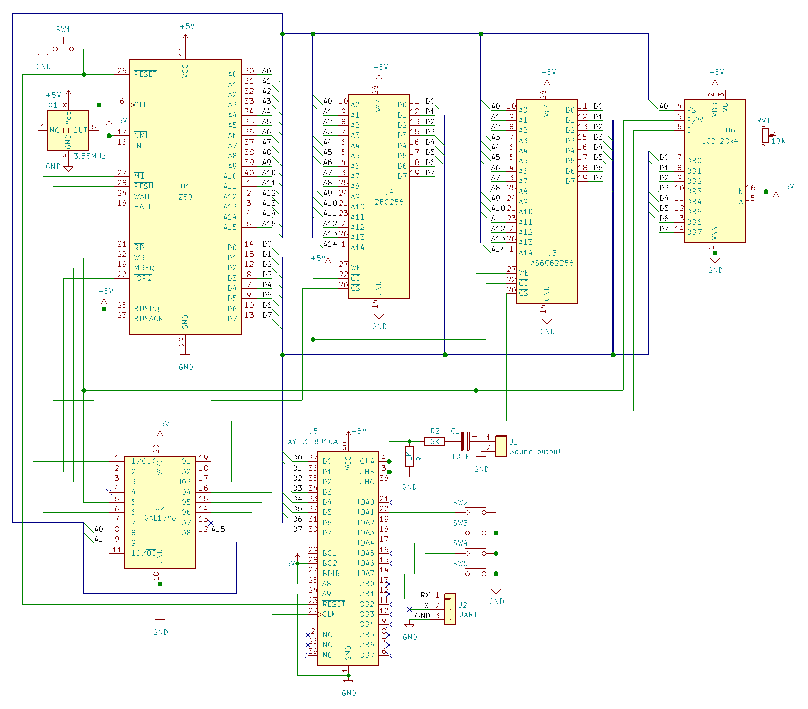

# myZ80 - A computer based on Z80 microprocessor
This is one more project for an 8bits computer based on Z80 microprocessor. It is assembled on breadboards with a lot of colorful wires and running with a few MHz clock! It can load binaries directly to RAM via an UART port, play songs and communicate with other external devices with a few GPIOs available. His architecture is pretty simple with CPU, memories and a few I/O peripheral devices. There are no LEDs, they are awesome, but useless when running with a clock in MHz!

## Loading a binary to RAM
We don't need to programmer our EEPROM every time after making a change in our code, we just need to load it to RAM. This computer can load Z80 binaries directly to RAM using UART protocol which needs to be setup first to 57600 baud, 8 bits, 1 stop bit and no parity (8N1):
```
$ stty -F /dev/ttyUSB0 57600 cs8 -cstopb -parenb raw
```
After that, we can easily load any binary with:
```
$ cat example.bin > /dev/ttyUSB0
```

## Creating Z80 binaries
I decided to use [vasm](http://sun.hasenbraten.de/vasm/) to create all binaries for this computer. This powerful assembler can ceate binaries for several platforms with different syntaxes, so for this project we need to compile it for Z80. After download it from his web page, we can compile it like this:
```
$ make CPU=z80 SYNTAX=oldstyle
```
Once compiled, we can create our Z80 binaries with:
```
$ vasmz80_oldstyle -Fbin -o example.bin examample.asm
```

## Architecture v1.0
In this first version the Z80 is running at 3.58Mhz, it can access until 64Kb of memory space. In this space we have 32Kb of EEPROM (AT28C256) from 0000h until 7FFFh and 32Kb of SRAM (AS6C62256) from 8000h until FFFFh. The CPU address line A15 is used to decode which one will be selected. If LOW, EEPROM will be selected, otherwise SRAM will be.<br><br>
Z80 can also make I/O requests! Using these requests, we can access several devices without waste memory space for it. For this first version, we have only two devices: a LCD (20x4 character display) and a PSG (AY-3-8910A Programmer Sound Generator). This PSG also has 16 GPIOs and we can connect more devices directly to it! We also need to decode which device will be selected, for that, we use CPU IORQ signal together with address line A1. If A1 is LOW, the display will be selected, otherwise the PSG will be.<br><br>
Usually, we need to use a lot of logic gates to make those decodes! To avoid having a lot of 74XX components to implement every logic gate, we can use GALs (Generic Array Logic). We can programmer almost all logic gates inside these chips. For this project, we only need to use one GAL (ATF16V8)! More details about how make address and I/O decode are [here](chip-select.pld). To programmer a GAL, we need a GAL assembler, I am using [GALasm](https://github.com/daveho/GALasm) to create the JEDEC file.<br><br>
When we turn on this computer, the program inside the EEPROM will initialize all devices (LCD and PSG), and will wait for a binary transfer to start from UART port. With 3.58Mhz, we have enough speed to synchronize with 57600 baud to receive all binary and load it in our SRAM. Once loaded, the program will be executed directly from SRAM without having to programmer again the EEPROM. In our EEPROM, we also have a few system calls, very useful to interact with LCD, more system calls will be added in the future!<br><br>
The circuit schematic for this version:<br>


